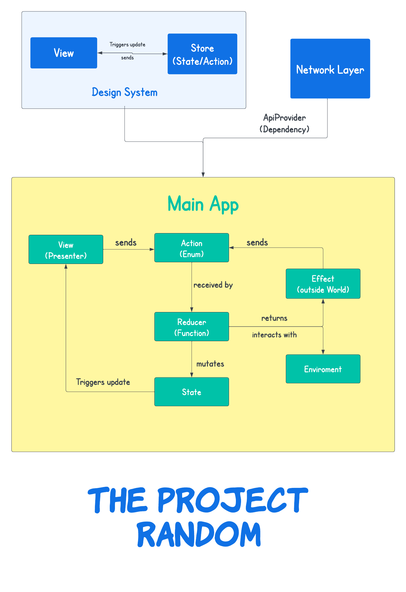

# The Random Project

## Working Context
> I started the project at midnight 1 Feb 2023. The weather was cold & dry and there were no constraints :).

## Architecture
This project is built using `The Composable Architecture` mainly but there are additional layers to support scalability & testing time, enhanced reliability and the flexibility to change by adding or replacing components without major disruption.
App consist of three layers
- Design system.
- Networking (supports generic collection data models).
- Main App (The main layer that consumes design components & network layer).

## Explanation 
I have demonstrated single responsiblity principle by creating separate layers of independent functionality i.e Views are used to represent only data and are kept stupid. User Actions are used to handle specific data mutation with pridictable code. User actions triggers respective case in reducer that changes state or start any outside world work. Dependency are kept centralised so that we can mock them while testing. 

## Developement Strategy
Break down main application into layers and go from bottom to Top. Uncontrollable to controllable parts.

## Commit Strategy
Simple & complete commits

## Future Proof
- Worked on `Xcode 14.1` which itself forces you to use new APIs for futuring proofing.
- Component-based design approch could be easily scale as you can test, scale based on your need independently.
- Network layer is generic to handle consist collections of different types of response model.
- Developing and testing features in isolation.
- Managing dependencies and side effects in an understandable way (readibility).
- TCA as framework is available that provides a convenient API to implement all components (Ergonomics).

## Test Coverage `72.2%`
